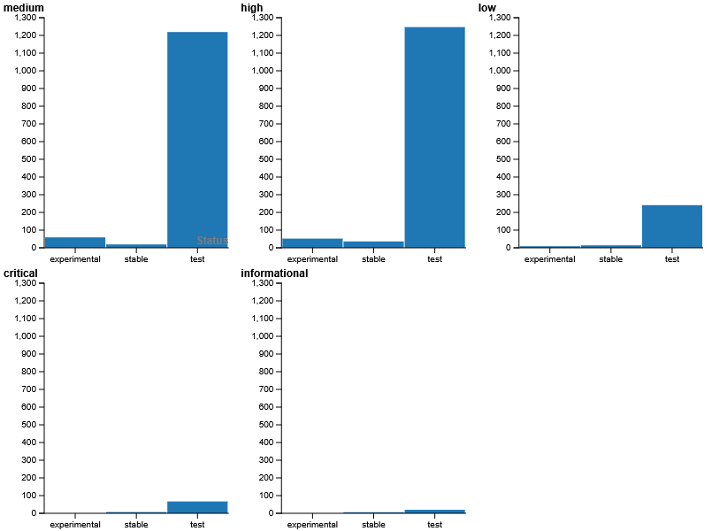

# Sigma Rule Summary

This repository provides a summarized spreadsheet (CSV) of detection rules sourced from the [SigmaHQ/sigma](https://github.com/SigmaHQ/sigma) GitHub repository. This summary aims to offer a concise overview of Sigma rules, focusing on their titles, creation and modification dates, severity levels, and current status.

---

## Table of Contents

* [About Sigma](#about-sigma)
* [Why This Summary?](#why-this-summary)
* [Repository Contents](#repository-contents)
* [How to Use This Summary](#how-to-use-this-summary)
* [Data Fields](#data-fields)
* [Contributing](#contributing)
* [Disclaimer](#disclaimer)

---

## About Sigma

[Sigma](https://github.com/SigmaHQ/sigma) is an open and generic signature format designed to describe relevant log events in a structured way. Its primary goal is to provide a standardized format for security researchers and analysts to share detection rules, which can then be converted into various SIEM (Security Information and Event Management) query languages and other formats.

---

## Why This Summary?

The [SigmaHQ/sigma](https://github.com/SigmaHQ/sigma) repository is an incredible resource, boasting **over 3,000 detection rules**. While this vast collection is invaluable, navigating through individual `.yml` files to understand each rule's purpose, status, and metadata can be time-consuming and challenging.

We created this CSV summary to provide a **quick and efficient way to explore these numerous rules**. By consolidating key metadata into a single, easily filterable spreadsheet, we aim to help security professionals, researchers, and enthusiasts:

* Rapidly identify rules of interest.
* Get a high-level overview without diving into every `.yml` file.
* Better manage and prioritize their exploration of Sigma rules.

---

## Repository Contents

* `sigma_rules_summary.csv`: This is the main CSV file containing the summarized information about Sigma rules.

---

## How to Use This Summary

You can open the `sigma_rules_summary.csv` file using any spreadsheet application (like Microsoft Excel, Google Sheets, or LibreOffice Calc) or a text editor.

This summary lets you quickly:

* **Identify recently created or modified rules**: Sort by `created date` or `modified date` to see the newest updates.
* **Filter by severity**: Easily find rules categorized by their `severity level` (e.g., `low`, `medium`, `high`, `critical`).
* **Check rule status**: Understand the maturity or operational state of a rule via its `status` (e.g., `stable`, `test`, `experimental`, `deprecated`).

You can also check the table in this url:

---

## Data Fields

The `sigma_rules_summary.csv` file includes the following fields (column headers):

* **`title`**: The human-readable name or title of the Sigma rule.
* **`created date`**: The date when the Sigma rule was originally created.
* **`modified date`**: The most recent date when the Sigma rule was modified.
* **`severity level`**: The assigned severity level of the rule (e.g., `low`, `medium`, `high`, `critical`).
* **`status`**: The current maturity or operational status of the rule (e.g., `stable`, `test`, `experimental`, `deprecated`).

---

## Contributing

This repository aims to provide a helpful summary. If you find errors in the summary data or have suggestions for improving this repository (e.g., adding an automation script), please feel free to open an issue or submit a pull request.

---

## Disclaimer

This summary is provided for informational purposes only. 

